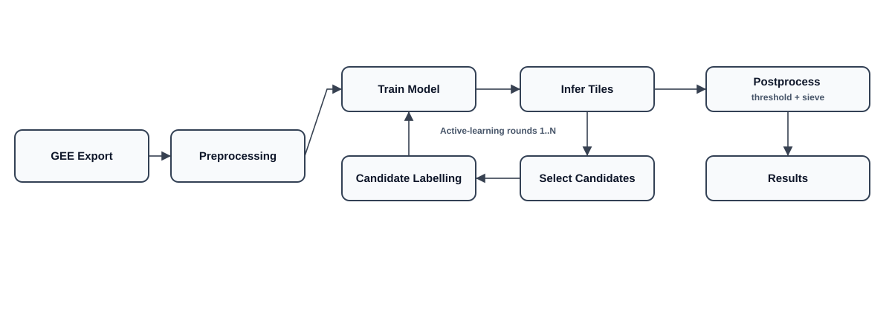

# Quantification and mapping of land cover change in Cape Verde


This repository contains the code and configuration for the MSc thesis “Quantification and mapping of land cover change in Cape Verde”. It is an end‑to‑end pipeline to map cropland and quantify change using multi‑temporal Sentinel‑2 surface reflectance from Google Earth Engine (GEE). It emphasizes label efficiency via an active‑learning loop, reproducible configuration, and clear outputs (KML overlays, per‑round statistics, and final maps). A companion LaTeX thesis is in `writtenThesis/` (content only; template is locked).

An older, experimental segmentation workflow lives under `scripts/backup (old)` for reference only.

## Highlights

- Earth Engine export of seasonal Sentinel‑2 stacks (3 seasonal windows by default)
- Per‑pixel feature engineering (bands, indices, light textures, terrain)
- Iterative active learning for label efficiency (uncertainty + spatial diversity)
- Compact, calibrated classifiers: SVM (RBF) and RandomForest
- Clean, reproducible post‑processing: explicit decision threshold and sieve size
- Two stats sets per round: normal‑threshold and a best‑threshold “advisory”
- Persistent informative pixel lists: Highscore (uncertain) and ProbableAgri (likely crops)
- Final compact grid search round (8–12 combos for the chosen model only)
- GPU optional (Torch diagnostics only), with a one-shot GPU checker script
- Memory watcher to reduce RAM spikes on long runs

## Repository Layout

```
PythonProject/
├── data/
│   └── phase1/
│       ├── raw/                # Downloaded Sentinel‑2 tiles (GeoTIFF)
│       ├── rounds/             # Round outputs (predictions, stats, KMLs)
│       └── cache/              # Feature cache (optional)
├── labels/
│   └── phase1/
│       ├── labels.csv          # Master labels
│       ├── temp_labels.csv     # Round‑by‑round appended labels
│       ├── highscore.csv       # Persistent list (uncertain + representative)
│       ├── probableAgri.csv    # Persistent list (likely crops)
│       └── *.kml               # KMLs for Google Earth
├── scripts/
│   ├── ready_to_run_phase1.py  # Orchestrates the whole pipeline
│   ├── a0_setup_check.py       # Environment checks + cleanup
│   ├── a1_phase1_data_download.py
│   ├── a2_phase1_initial_labeling.py
│   ├── a3_phase1_active_learning_round.py
│   ├── a4_phase1_active_learning_loop.py
│   ├── a6_phase1_postprocessing.py
│   ├── final_grid_search.py    # Final compact grid search round
│   ├── generatePersistents.py  # Rebuild persistent lists from saved rounds
│   ├── refresh_lists.py        # Global refresh using predictions.csv
│   ├── check_gpu_acceleration.py # GPU diagnostics (Torch)
│   ├── config.py               # Central configuration
│   └── backup (old)/           # Archived experimental code
├── writtenThesis/              # LaTeX thesis content (template locked)
├── requirements.txt
└── README.md
```

## Installation

- Python 3.12 recommended.
- Windows, Linux, and WSL2 supported; GPU is optional.

1) Install dependencies

```
pip install -r requirements.txt
```

2) Authenticate GEE

```
earthengine authenticate
```

3) Optional: enable GPU acceleration

```
python scripts/check_gpu_acceleration.py
```

If PyTorch CUDA shows False on Windows, install the CUDA wheel in the same venv:

```
pip uninstall -y torch torchvision torchaudio
pip install --index-url https://download.pytorch.org/whl/cu124 torch==2.5.0 torchvision torchaudio
```

## Quick Start

Run the end‑to‑end Phase‑1 pipeline:

```
python scripts/ready_to_run_phase1.py
```

The orchestrator performs:

1. Setup check – validates GEE auth, cleans leftovers, snaps label coords to pixel centers.
2. Data download – exports Sentinel‑2 tiles for the configured ROI/islands (see `a1_phase1_data_download.py`).
3. Initial labeling – interactive labeling until a minimal balanced seed set is reached.
4. Active learning – trains a model and proposes uncertain/spatially diverse candidates for you to label; repeats for N rounds.
5. Post‑processing – thresholds and sieves per‑pixel probabilities to overlays and summary stats.
6. Final grid search round – compact hyper‑parameter search (8–12 combos) for the chosen model only, then one final full‑tile inference for the winner.

Outputs live under `data/phase1/rounds/round_*` (per round) and `data/phase1/rounds/final_round/…`.

Resume/interruptions: The pipeline writes `data/phase1/checkpoint.txt`; re‑running offers to resume at the last step/round.

## Configuration (scripts/config.py)

Plain‑English meanings first; file has more details.

- Thresholds: `MIN_AGRI_PROB` is the decision threshold. A pixel with predicted prob ≥ this is agriculture; otherwise not.
- Sieve: `SIEVE_MIN_SIZE` removes connected components smaller than this many pixels (reduces speckle).
- Best‑threshold outputs: `BEST_THRESHOLD_OUTPUTS_ENABLED=True` writes an additional stats set and KML using a weighted score to pick the best t (precision‑heavy weighting by default).
- Models: choose between `SVM` and `RandomForest`. Probabilities are calibrated (isotonic) for stable maps.
- Active learning: `NUM_CANDIDATES_PER_ROUND`, `CANDIDATE_PROB_LOWER`, `CANDIDATE_DBSCAN_EPS_KM`, and negative‑like quotas/NDVI filters.
- Persistent lists: `HIGHSCORE_LIST_ENABLED`, `PROBABLE_AGRI_LIST_ENABLED`, `HIGHSCORE_TOP_K`, `PROBABLE_AGRI_TOP_K` (defaults 10k), with matching KML caps.
- Performance: `INFER_TILE_THREADS`, `INFER_MAX_PIXELS_PER_BATCH`, feature disk cache, and BLAS/OpenMP thread caps.
- Final sweep (optional) and final grid search (compact) can both be used; the final grid search is wired into the pipeline end.

All paths are defined relative to the project root (`data/phase1`, `labels/phase1`).

## Scripts Overview

- `ready_to_run_phase1.py` – orchestration; prompts for model/params; runs rounds, post‑processing, and the final grid search.
- `a1_phase1_data_download.py` – exports seasonal Sentinel‑2 composites from GEE for the ROI.
- `a2_phase1_initial_labeling.py` – interactive labeling UI; supports predefined notes.
- `a3_phase1_active_learning_round.py` – trains model, runs inference per tile, generates predictions, KMLs, and stats (normal + best‑th if enabled).
- `a4_phase1_active_learning_loop.py` – loops rounds; supports coarse grid or manual params.
- `a6_phase1_postprocessing.py` – sweeps threshold/sieve combos for overlays (optional) and writes summaries.
- `final_grid_search.py` – evaluates ~10 combos for the chosen model only, then runs one final full inference for the winner.
- `generatePersistents.py` – rebuilds persistent lists (Highscore/ProbableAgri) from all saved rounds; menu: 1=Highscore, 2=ProbableAgri, 3=Both.
- `refresh_lists.py` – updates Highscore/ProbableAgri from an existing predictions.csv (streaming, memory‑safe).
- `check_gpu_acceleration.py` – one-shot GPU diagnostics for Torch.

## Persistent Lists

Two global CSV+KML lists help with targeting labeling and QA:

- Highscore – uncertain yet representative pixels. Weighted by uncertainty, representativeness, and consistency.
- ProbableAgri – likely positive pixels (by probability and representativeness; deduped). Useful to guide positive verification.

Rebuild from saved rounds:

```
python scripts/generatePersistents.py
```

Select 1, 2, or 3. Existing requested CSV/KML are deleted then rebuilt; unrequested lists are left intact.

## Final Grid Search Round

At the very end of the pipeline, a compact grid search runs for the model you chose (only that model):

- SVM: 12 combos (C∈{1,3,5} × gamma∈{scale,auto} × class_weight∈{None,balanced})
- RandomForest: ~8–12 curated combos for speed vs. quality
- Selection metric: weighted best‑threshold score (precision‑biased), using the same validation split as round stats
- Only the winner is run over full tiles to produce final outputs

Run standalone if needed:

```
python scripts/final_grid_search.py --model SVM
```

## GPU Acceleration

Check status:

```
python scripts/check_gpu_acceleration.py
```

- If Torch shows CUDA=False on Windows, install the CUDA wheel in your venv:
  `pip install --index-url https://download.pytorch.org/whl/cu124 torch==2.5.0 torchvision torchaudio`
## Tips & Troubleshooting

- Earth Engine: run `earthengine authenticate` once per environment; if requests fail, re‑authenticate.
- NotGeoreferencedWarning: harmless when operating on in‑memory arrays; verify saved overlays align by opening in GIS.
- Missing predictions: ensure raw tiles exist under `data/phase1/raw/*.tif` and that models are saved under each round folder.
- Performance: lower `INFER_TILE_THREADS` if RAM spikes; use the feature cache to reduce recompute.

## License and Credits

This project builds on the Sentinel‑2 mission (ESA), GEE, and open‑source geospatial/ML libraries. The `writtenThesis/` folder contains the thesis content.

- Code: released under the GNU GPL‑3.0 (see `LICENSE`).
- Data/overlays generated by this pipeline may be subject to Copernicus and GEE terms; please attribute accordingly.

## Visual Overview

<p align="center">
  
</p>

## Reproducibility Checklist

- Python 3.12 environment set with `requirements.txt`.
- GEE authenticated (`earthengine authenticate`).
- `scripts/config.py` captures thresholds, model params, and performance toggles; each round also saves a `config_snapshot.json` in its stats folder.
- Seeds: set `SPLIT_SEED_MODE` to `fixed` and `SPLIT_RANDOM_SEED` for fully repeatable evaluation splits.
- Feature cache enabled to avoid recomputation across runs.

## Cite This Work

If you use this code or workflow, please cite the thesis:

Fernandes, J. A. M. (2025). Quantification and mapping of land cover change in Cape Verde. MSc Thesis, Department of Computer Science, Faculty of Sciences, University of Porto.

BibTeX (placeholder):

```
@mastersthesis{fernandes2025capeverde,
  author = {José Alberto Martins Fernandes},
  title  = {Quantification and mapping of land cover change in Cape Verde},
  school = {Faculdade de Ciências da Universidade do Porto},
  year   = {2025}
}
```
